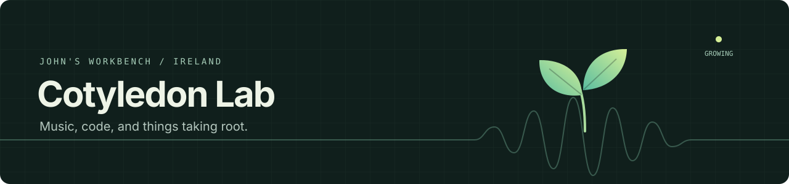

I'm John, in Ireland. Cotyledon Lab is where I tinker with music software, AI agents, and small tools I want to use myself.

Lately I've been spending a lot of time in Codex and ChatGPT, following ideas from conversation into working code. The question I keep coming back to: **what would make an AI agent useful in a music studio?**

### On the workbench

- **Agents in the studio.** Exploring session musicians and an engineer working through REAPER, with SuperCollider and plugin rendering behind the scenes. I want to hear alternative takes, keep the mixer under my hands, and ask for a revision without losing the bits I like.
- **A small, scriptable DAW.** Building an audio core that scripts and agents can inspect and control. Starting with playback, sequencing, and saved sessions; experimenting with plugin hosting and ways to connect other sound engines.
- **Tools for everyday friction.** Things like a Safari extension that follows system appearance and a podcast picker for a particular length of walk. Small enough to build because something annoyed me.
- **How to work with agents.** Trying out instructions, reusable skills, parallel work, and handoffs. Learning where they help, where they get tangled, and how to check that something actually works.

These are experiments at different stages. Some live in public repositories; others are still on the bench.

### A few things to explore

| Project | What you'll find |
| --- | --- |
| [LLM Studio](https://github.com/cotyledonlab/llm-studio) | A producer-led music studio experiment with agent musicians, REAPER, and background audio rendering. Work in progress. |
| [Lights On](https://github.com/cotyledonlab/lights-on) | An experiment in a reusable software-building scaffold, starting with a local receipt-review workflow. |
| [Seq](https://github.com/cotyledonlab/seq) | An earlier browser step sequencer and drum machine. |
| [Podfetch](https://github.com/cotyledonlab/podfetch) | A CLI for finding podcast episodes that fit the time you have. |

### Compare notes

If you're exploring music tools, creative coding, or agents that can do something useful beyond a chat window, I'd enjoy comparing notes. Questions and ideas are welcome in the relevant repo's issues.

A cotyledon is a seed's first leaf. The name still fits.
